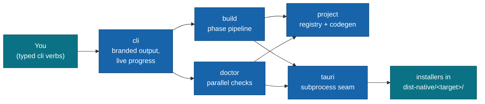

# @moku-labs/native

**Compose system plugins, get native installers — the entire permission surface is codegenned, never hand-maintained.**

`@moku-labs/native` is the Moku family's node-only native packager: a [`@moku-labs/core`](https://github.com/moku-labs/core) Layer-2 framework that wraps [Tauri 2](https://v2.tauri.app) end-to-end. It generates a gitignored Tauri project, codegens the permission surface (Tauri capabilities, the `Info.ios.plist` sidecar, `AndroidManifest.xml` needs) from whichever system plugins your app composed, and drives `tauri build` for all five targets — macOS, Windows, Linux, iOS, Android. It is not a runtime and ships nothing inside your app: the generated Tauri project is disposable build output, never committed source.

<br/>

[](https://www.npmjs.com/package/@moku-labs/native)
[](#requirements)
[](#requirements)
[](https://github.com/moku-labs/core)
[](./LICENSE)

<br/>

[Quick start](#quick-start) · [Two apps, one contract](#two-apps-one-contract) · [Plugins](#plugins) · [Configuration](#configuration) · [Signing and store builds](#signing-and-store-builds) · [iOS simulator](#ios-simulator) · [Events](#events) · [Docs](#docs)

---

## Why @moku-labs/native

- **The composition IS the permission surface.** Declare `{ name: "notification" }` once in `config.system` and the capability registry resolves it into npm/crate dependencies, Rust plugin init, capability JSON, and mobile permission needs — no hand-edited `tauri.conf.json`, no drifting plist.
- **Generated, gitignored, regenerable.** `.moku/tauri/` is build output, not source. Delete it, run a build, and the write-if-changed generators reproduce it byte-for-byte — the "minimal troubles" promise lives here.
- **One subprocess seam.** Only the `tauri` plugin spawns processes — everything reaching `@tauri-apps/cli` goes through its argv builders, entropy-gated secret scrubbing, error taxonomy, and process-group dev lifecycle.
- **A packager, not a runtime.** Node-only, the deploy/CLI analogue for native packaging. Nothing here executes inside your shipped app; your web app stays exactly what it was.
- **Secrets stay in env vars.** Config carries env-var *references* only (`signing.android.keystorePasswordEnv`), doctor checks presence without reading values, and every subprocess output line is scrubbed before it can reach a log.

## Quick start

```sh
bun add @moku-labs/native
```

> [!NOTE]
> **Status: `0.x` — early.** `@moku-labs/core` and `@moku-labs/common` install transitively as regular dependencies — one `bun add` is the whole install. A real `node` binary on PATH is a hard prerequisite (`@tauri-apps/cli` cannot run under bun); `native doctor` checks it.

A native app is its own `createApp` — typically `src/native.ts`, beside your web app:

```ts
// src/system.ts — the system-plugin composition, shared with your web app
export const systemPlugins = [{ name: "store" }, { name: "deep-link" }];
```

```ts
// src/native.ts — the native createApp (Layer 3)
import { createApp } from "@moku-labs/native";
import { systemPlugins } from "./system";

export const native = createApp({
  config: {
    app: { name: "MyApp", identifier: "com.example.myapp", icon: "assets/icon.png" },
    web: {
      build: "bun run build",
      devCommand: "bun run dev", devUrl: "http://localhost:5173",
      dist: "dist"
    },
    system: systemPlugins,
    capabilities: { "deep-link": { mode: "scheme", scheme: "myapp" } },
    targets: ["macos", "ios"] // default: the host's own desktop target — mobile is opt-in
  }
});
```

`app.icon` is a 1024×1024 PNG. Leave it out and a placeholder is generated, so a brand-new app packages before anyone has drawn an icon.

```ts
// scripts/native-build.ts — one thin script per verb
import { native } from "../src/native";

await native.start();
await native.cli.build({ target: "macos" }); // installers land in dist-native/macos/
await native.stop();
```

> [!IMPORTANT]
> Add `.moku/` and `dist-native/` to your `.gitignore`. The generated Tauri project is never committed — it is fully regenerable output.

## How it works



Each `build.run({ target })` walks the phase pipeline `scaffold → codegen → icons → compile → bundle → collect` (the `PHASE_ORDER` constant), emitting a global `native:phase` event per phase and `native:complete` on success — which is exactly what `cli` renders as live progress. `project` and `tauri` never call each other; `build` orchestrates them, `doctor` reads them, `cli` fronts all four.

### The composition is the contract

`config.system` is a name-only array — `ReadonlyArray<{ name: string }>` — and that one list drives the whole packaging surface. The `project` plugin resolves each name against its capability registry (`store`, `notification`, `clipboard-manager`, `tray`, `deep-link`) into a `ResolvedCapability`: npm package + crate ranges, Rust init line, capability permissions, per-platform applicability, and conf fragments. Unknown names fail at composition time, not at build time. In v1 the mobile permission surface is conf-only by verified design — the official Tauri plugins self-merge their own manifest needs — so zero fragile XML patching ships at all.

## Two apps, one contract

Your project runs **two `createApp`s side by side**: the web/node app you already have, and the native app (`src/native.ts`) from this framework. Plugins are bound to their own framework's chain, so native plugins can never be composed into the web app — the two apps integrate at the edges instead:

- **`src/system.ts` is the shared contract.** Both apps import the same array of `{ name }` system-plugin declarations. The web app uses it to know which capabilities exist; the native app codegens the entire permission surface from it. One list, no drift — this is the cross-team contract.
- **Scripts stay thin, one verb each.** `package.json` wires per-verb consumer scripts that call the native app's typed `cli` verbs — there is no argv CLI to parse:

  ```jsonc
  {
    "scripts": {
      "native:dev": "bun run scripts/native-dev.ts",
      "native:build": "bun run scripts/native-build.ts",
      "native:doctor": "bun run scripts/native-doctor.ts",
      "native:clean": "bun run scripts/native-clean.ts"
    }
  }
  ```

  ```ts
  // scripts/native-doctor.ts
  import { native } from "../src/native";

  await native.start();
  const ok = await native.cli.doctor();
  await native.stop();
  if (!ok) process.exitCode = 1;
  ```

- **Directory roles.** `projectDir` (default **`.moku/tauri/`**) is the generated Tauri project — gitignored, fully regenerable, never committed. `outDir` (default **`dist-native/`**) is where finished installers are collected, per target (`dist-native/macos/`, `dist-native/android/`, …).

## Plugins

| Plugin | Tier | Key API | Responsibility |
|---|---|---|---|
| [`project`](./src/plugins/project/README.md) | Complex | `generate` · `completeness` · `patchMobile` · `ensureIconSource` · `clean` · `resolve` | Capability registry + `.moku/tauri` generators + write-if-changed writer + mobile init-once-then-patch. Owns the generated tree as *files*; never spawns. |
| [`tauri`](./src/plugins/tauri/README.md) | Standard | `icon` · `build` · `mobileInit` · `dev` · `version` · `runner` | The framework's **only** subprocess seam: `@tauri-apps/cli` argv builders, injectable spawn, process-group dev lifecycle, error taxonomy, secret scrubbing. |
| [`build`](./src/plugins/build/README.md) | Standard | `prepare` · `run` · `runAll` | Sequential per-target phase pipeline; emits `native:phase`/`native:complete`; owns the `collect` phase (bundle-location table → `dist-native/<target>/`). |
| [`doctor`](./src/plugins/doctor/README.md) | Complex | `run` | Per-target toolchain/completeness/version-skew diagnosis via a `checks/` registry, run in parallel — one broken check never sinks the report. |
| [`cli`](./src/plugins/cli/README.md) | Standard | `build` · `dev` · `doctor` · `clean` | Typed verb surface — no argv parsing. Branded rendering (`@moku-labs/common/cli`), live progress via event hooks. |

Every lower-level surface stays reachable on the composed app: `native.project.generate(…)`, `native.tauri.getVersion()`, `native.build.runAll()`, `native.doctor.run()` — `cli` is convenience, not a gate.

## Configuration

The substantive surface is **global** `Config` — every plugin reads it via `ctx.global`; per-plugin configs are minimal seams.

| Field | Type | Default | Notes |
|---|---|---|---|
| `app.name` | `string` | `""` | Display name (`productName`). Required — validated at composition time. |
| `app.identifier` | `string` | `""` | Reverse-DNS bundle id. Required — validated at composition time. |
| `app.version` | `string?` | unset → `"0.1.0"` | Marketing version. |
| `app.icon` | `string?` | unset | 1024×1024 PNG, relative to cwd. Unset → a placeholder PNG is generated. |
| `app.category` | `string?` | unset | Store category → `bundle.category`. |
| `app.buildNumber` | `string?` | unset | Store build number → `bundle.{iOS,macOS}.bundleVersion`. |
| `web.build` | `string` | `"bun run build"` | Runs before a build, in `web.cwd`. |
| `web.devCommand` | `string` | `"bun run dev"` | Runs before `dev`, in `web.cwd`. |
| `web.devUrl` | `string` | `"http://localhost:5173"` | Dev server URL — also the `DevHandle.url` and the readiness-poll target. |
| `web.dist` | `string` | `"dist"` | Web build output, resolved from `web.cwd` and rebased onto `src-tauri`. |
| `web.cwd` | `string?` | unset → the process cwd | Root of the web package — monorepo layouts. Everything web-shaped resolves from here. |
| `system` | `ReadonlyArray<{ name: string }>` | `[]` | The composed system plugins — the shared cross-team contract. Unknown names throw at init. |
| `capabilities` | `Partial<CapabilityConfigMap>` | `{}` | Per-capability packaging parameters. `deep-link` requires `{ mode: "scheme", scheme: string }`. |
| `targets` | `readonly Target[]` | `hostTargets(process.platform)` | The host's own desktop target (`darwin`→`macos`, `win32`→`windows`, `linux`→`linux`). **Mobile is opt-in**: name `ios`/`android` explicitly. |
| `projectDir` | `string` | `".moku/tauri"` | Generated Tauri project root (contains `src-tauri/`). Gitignored build output. |
| `outDir` | `string` | `"dist-native"` | Installer delivery root — `collect` copies finished artifacts to `outDir/<target>/`. |
| `signing.apple` | `AppleSigning?` | unset | `teamId`, `signingIdentity`, `providerShortName`, `entitlements`, `appStore`, `exportMethod`, `macosMinimumSystemVersion`, `iosMinimumSystemVersion` — see [Signing and store builds](#signing-and-store-builds). |
| `signing.android` | `{ keystorePath?, keystorePasswordEnv?, keyPasswordEnv?, keyAlias? }` | unset | Env-var **names**, never secrets. `keyPasswordEnv` falls back to `keystorePasswordEnv`. |
| `signing.windows` | `{ certificateThumbprint? }` | unset | Windows signing certificate thumbprint. |

Per-plugin knobs, overridable via `createApp({ pluginConfigs })`:

| Plugin | Knob | Default | Purpose |
|---|---|---|---|
| `tauri` | `spawnImpl` / `nodePath` | `undefined` / `undefined` | Test seam / explicit `node` path (default: real process-group spawn, PATH-walked node). |
| `tauri` | `arch` | `undefined` | Host arch the iOS simulator slice is derived from (default: `process.arch`). `x64` → `--target x86_64`, anything else → `--target <arch>-sim`. Pin it in tests so an argv assertion does not depend on the machine running it. |
| `tauri` | `readiness` | `{ intervalMs: 250, timeoutMs: 60_000 }` | `dev()`'s devUrl readiness poll — there is no stdout "ready" marker. |
| `doctor` | `probeImpl` | `undefined` | Test seam for binary probes (default: real `which`/`--version` subprocesses). |
| `doctor` | `probeTimeoutMs` | `10_000` | Per-check budget. A check that outruns it becomes a `warn`, never a `fail`. |
| `cli` | `renderImpl` / `confirmImpl` | `undefined` / `undefined` | Test seams (default: branded console + styled confirm from `@moku-labs/common/cli`). |

Three behaviours worth knowing before the first build:

- **Placeholder icon.** `project.ensureIconSource()` returns `path.resolve(app.icon)` and throws a `[native]` fix-it when that file is missing. With `app.icon` unset it writes an embedded 1024×1024 PNG to `<projectDir>/placeholder-icon.png` and returns that. The icons phase reports `generated`, `placeholder`, or `up to date`.
- **`tray` is a cargo feature, not a plugin.** Composing `{ name: "tray" }` adds `tray-icon` to the `tauri` dependency's features in the generated `Cargo.toml` — no crate, no npm package, no Rust init line. Every other registry row is a real plugin, so `RegistryRow.npmPackage`/`crate` are optional and consumers of `getRegistryRows()` null-check them. Its permission list is `core:tray:default`, `core:menu:default`, `core:image:default`, `core:resources:default`, `core:app:allow-default-window-icon` — the last one matters, because `@moku-labs/system` defaults the tray icon to `defaultWindowIcon()` and `core:default` does not grant that command, so without it a real macOS shell fails with `Command plugin:app|default_window_icon not allowed by ACL`.
- **`clean()` refuses anything that is not derived state.** The rule is positive containment, not a blacklist: `projectDir` must resolve strictly *inside* the **project anchor** (or a usable OS temp root, where test workspaces live) and must not be — or contain — the anchor, the cwd or the home directory, nor be a filesystem root. The anchor is the nearest ancestor of the cwd carrying a `.git` entry or a `workspaces` `package.json`, stopping before `$HOME` and the filesystem root — so an absolute `projectDir` at a monorepo root still validates when the script runs from `packages/app`. A temp root that is a filesystem root, or that is/contains `$HOME`, grants nothing (`os.tmpdir()` follows `TMPDIR`). Symlinks are resolved with `realpath`, and comparison is case-insensitive on macOS/Windows. `assertCleanableRoot` throws before any path is computed, and `createApp` rejects the same `projectDir` up front:

  ```
  [native] Refusing to clean projectDir "<root>".
    Set config.projectDir to a dedicated subdirectory such as ".moku/tauri".
  ```

- **`outDir` gets the looser rule.** It is written into and replaced file by file, never recursively cleaned, so a CI cache mount or a shared artifacts volume outside the checkout is legitimate. `createApp` refuses only a filesystem root, `$HOME` itself, and any ancestor of the cwd or of `$HOME`. The `collect` phase then resolves both `outDir` and each destination to their **real** paths before removing anything, so a symlinked `<outDir>/<target>` pointing into another tree is refused rather than wiped.

> [!IMPORTANT]
> **Do not replace `pluginConfigs.env.providers`.** The framework seeds `[workerSafeProcessEnv()]` in `src/config.ts` so `ctx.env.get("PATH")` resolves. Core-plugin config is a **shallow merge**, so passing your own `providers` array replaces that list instead of extending it — `PATH` goes `undefined` and every build dies with `[native] Could not locate a \`node\` binary on PATH.` If you override it, re-add the provider: `providers: [workerSafeProcessEnv(), yourProvider]`. (The typed `createApp({ pluginConfigs })` map covers the framework's own plugins only, so reaching `env` at Layer 3 takes a cast — the kernel still merges it at runtime.)

## Signing and store builds

The split is absolute: **config holds identifiers and env-var names, the environment holds secrets.** Tauri reads the credentials itself, so nothing secret is ever written to `tauri.conf.json`, to Gradle, or to a log line (every subprocess line is scrubbed first).

```ts
signing: {
  apple: {
    teamId: "ABCDE12345",              // bundle.iOS.developmentTeam
    signingIdentity: "Developer ID Application: ACME (ABCDE12345)", // "-" = ad-hoc
    providerShortName: "ACME",         // multi-team notarization
    entitlements: "build/App.entitlements", // your plist, relative to cwd
    appStore: true,                    // no entitlements? generate a sandbox plist for macOS
    exportMethod: "app-store-connect", // tauri ios build --export-method
    macosMinimumSystemVersion: "12.0",
    iosMinimumSystemVersion: "15.0"
  },
  android: {
    keystorePath: "release.jks",
    keystorePasswordEnv: "ANDROID_KEYSTORE_PASSWORD",
    keyPasswordEnv: "ANDROID_KEY_PASSWORD", // falls back to keystorePasswordEnv
    keyAlias: "release"
  }
}
```

In the environment (never in config) — Tauri reads these directly:

| Variable(s) | Used for |
|---|---|
| `APPLE_ID` + `APPLE_PASSWORD` + `APPLE_TEAM_ID` | Notarization with an app-specific password. |
| `APPLE_API_KEY` + `APPLE_API_ISSUER` + `APPLE_API_KEY_PATH` | Notarization with an App Store Connect API key. Either set is enough. |
| `APPLE_CERTIFICATE` + `APPLE_CERTIFICATE_PASSWORD` | Base64 signing certificate imported into a CI keychain. |
| `<keystorePasswordEnv>` / `<keyPasswordEnv>` | Android release signing — Gradle reads them via `System.getenv` at build time. |

What each piece does:

- **`teamId`** goes into `bundle.iOS.developmentTeam`; `doctor` warns on an iOS target without it.
- **`signingIdentity`** goes into `bundle.macOS.signingIdentity`; `"-"` means ad-hoc. When it is a real identity, `doctor` probes the keychain for a **count** of codesigning identities (never the names), and skips that probe when `APPLE_CERTIFICATE` is set.
- **`appStore: true`** with no `entitlements` generates `src-tauri/Entitlements.plist` (app sandbox + network client) for macOS and points `bundle.macOS.entitlements` at it.
- **`exportMethod`** is forwarded to `tauri ios build --export-method` on device archives. A simulator build ignores it.
- **Android**: `patchMobile` maintains a `// MOKU-SIGNING-START … END` block in `gen/android/app/build.gradle.kts`. Dropping `keystorePath` removes it again. No `keystore.properties` is written.

> [!NOTE]
> **Unsigned dev builds and iOS simulator builds need none of this.** `doctor`'s signing check is warn-only for exactly that reason — a missing credential never fails a build, and never flips `report.ok`.

## iOS simulator

```ts
await native.cli.build({ target: "ios", simulator: true });
// unsigned <Product Name>.app -> dist-native/ios/
```

`simulator: true` builds `--target aarch64-sim` (`x86_64` on an Intel host — Tauri's Intel simulator slice carries no `-sim` suffix), never exports an archive, and collects the `.app` **directory** instead of an `.ipa`, from `gen/apple/build/*-sim/` or `gen/apple/build/x86_64/`. Prerequisites, all checked by `native doctor`:

| Need | Install | Doctor check |
|---|---|---|
| Rust targets `aarch64-apple-ios`, `aarch64-apple-ios-sim` | `rustup target add aarch64-apple-ios aarch64-apple-ios-sim` | `ios-tools` (fail) |
| `xcodegen` | `brew install xcodegen` | `ios-tools` (fail) |
| `pod` (CocoaPods) | `brew install cocoapods` | `ios-tools` (fail) |
| An installed iOS platform + simulator runtime | `xcodebuild -downloadPlatform iOS` | `ios-platform` (warn) |

The first iOS build also runs `tauri ios init` once, then rewrites the build phase Tauri baked into the generated Xcode project: it calls whichever runner Tauri *detected* (`node tauri`, `bun tauri`, …), and none of those resolve inside Xcode. `project.patchMobile({ target, runner: tauri.getRunner() })` replaces it with the absolute `<node> <tauri.js>` pair this framework spawns with. The pass is idempotent.

## When a build fails

A non-zero `@tauri-apps/cli` exit throws a `TauriError` carrying `kind`, `exitCode` and a scrubbed `stderrTail` (the last cause lines first, then the raw tail — `cli` prints it in a branded box above the error line, each line truncated to the branded console's width minus the box chrome). Classification runs over the *cause* lines of both streams only, most specific first, so one incidental `CodeSign` line in a 50k-line xcodebuild log cannot decide the taxonomy:

| `kind` | Means |
|---|---|
| `xcode-script-failed` | The Xcode "Build Rust Code" phase failed — check the runner line in `gen/apple/project.yml`. |
| `signing-failed` | codesign / provisioning profile / notarization / keychain / signtool / jarsigner / keystore. |
| `toolchain-missing` | `command not found`, `xcode-select`, `ANDROID_HOME`, missing NDK, `rustup`. |
| `platform-missing` | The iOS platform is not installed — `xcodebuild -downloadPlatform iOS`. |
| `device-unavailable` | No device or booted simulator. |
| `config-invalid` | Tauri could not parse/read the generated `tauri.conf.json`. |
| `compile-failed` | Rust compile errors. |
| `cancelled` | Signal-terminated (exit code `null`) with no pattern match — Ctrl-C. |
| `unknown` | Nothing matched; read the tail. |

## Events

Two **global framework events** are declared in `src/config.ts` — emitted by `build`, hooked by `cli`, hookable by any plugin without a depends edge:

```ts
"native:phase": {
  target: Target;
  phase: NativePhase; // "scaffold" | "codegen" | "icons" | "compile" | "bundle" | "collect"
  status: "start" | "progress" | "done" | "error";
  durationMs?: number;
  detail?: string; // progress ticks ("Compiling tauri 3/50"), skip reasons, error text
};
"native:complete": {
  target: Target;
  outPath: string; // dist-native/<target>/
  artifacts: readonly string[];
  durationMs: number;
};
```

One **per-plugin event** is declared by `doctor` (hookable via a `depends: [doctorPlugin]` edge):

```ts
"doctor:check": CheckResult; // { id, target: Target | "host", status: "pass" | "warn" | "fail", message, fixIt? }
```

> [!TIP]
> Compile progress details carry real crate counts parsed from cargo output — never a synthesized percentage.

## Breaking changes in this release

| What breaks | Migration |
|---|---|
| `web.dev.command`, `web.dev.url` | Use the flat `web.devCommand`, `web.devUrl` (config is shallow-merged, so a nested `dev` object could never merge cleanly). |
| `tauri.mobileInit({ platform })` | `tauri.mobileInit({ target })`. |
| `Build`, `Cli`, `Doctor`, `Project`, `Tauri` are type-only namespaces | Import the one runtime value by name: `import { TauriError } from "@moku-labs/native"`. |
| Default `targets` is no longer all five | It is now the host's own desktop target. Set `targets` explicitly to build `ios`/`android`. |
| `Project.RegistryRow` plugin fields are optional | Null-check `npmPackage`/`crate`/`rustInit` — the `tray` row is a cargo feature and carries none of them. |

## Scripts

```sh
bun run build              # Build with tsdown
bun run lint               # Biome check + ESLint
bun run lint:fix           # Auto-fix lint issues
bun run format             # Format with Biome
bun run test               # Unit + integration (vitest) — never the smoke project
bun run test:unit          # Unit tests only
bun run test:integration   # Integration tests only
bun run test:coverage      # Unit + integration with coverage (90% threshold)
bun run test:smoke         # Real toolchain: a genuine tauri build in a temp dir (opt-in, slow)
bun run validate           # publint + are-the-types-wrong (publish readiness)
```

## Development

- **Adding a plugin** — create `src/plugins/<name>/` with `index.ts` (the `createPlugin` call), `types.ts`, and an API factory; register the instance in `src/index.ts`'s plugin array and re-export it from `src/plugins/index.ts`. Consumer apps can also author their own plugins with the exported `createPlugin` and pass them to `createApp({ plugins: [...] })`.
- **Tests** — plugin-specific tests are colocated (`src/plugins/<name>/__tests__/unit/` and `__tests__/integration/`); root `tests/` holds framework-level integration only. All subprocess/render/probe seams are injectable, so `bun run test` runs without any native toolchain. `tests/smoke/` is the one exception — `bun run test:smoke` packages a real macOS `.app` and a real iOS simulator `.app` inside a fresh `mkdtemp` workspace, and is never part of `bun run test`. It composes all five capabilities and launches the built macOS binary for a few seconds (a window flashes on screen), because a generated config Tauri cannot deserialize builds fine and only aborts on the first frame.

## Requirements

- **Node `>= 24`** and **Bun `>= 1.3.14`** — use `bun` exclusively (never npm/yarn/pnpm). A real `node` binary must also be on PATH for `@tauri-apps/cli`.
- **TypeScript** in strict mode, with `exactOptionalPropertyTypes` and `noUncheckedIndexedAccess`.
- **[`@moku-labs/core`](https://github.com/moku-labs/core)** — the micro-kernel this framework is built on (direct dependency).
- Native toolchains only for the targets you actually build — `native doctor` tells you what's missing per target. iOS additionally needs `xcodegen`, `cocoapods`, both iOS rust triples, and an installed iOS platform (see [iOS simulator](#ios-simulator)).

## Docs

- Per-plugin references: [`project`](./src/plugins/project/README.md) · [`tauri`](./src/plugins/tauri/README.md) · [`build`](./src/plugins/build/README.md) · [`doctor`](./src/plugins/doctor/README.md) · [`cli`](./src/plugins/cli/README.md)
- LLM-ready docs: [`llms.txt`](./llms.txt) (concise) · [`llms-full.txt`](./llms-full.txt) (full type/event/config reference)
- [Moku Core specification](https://github.com/moku-labs/core/tree/main/specification) — the three-layer model, factory chain, lifecycle, and event system this framework implements.

## License

[MIT](./LICENSE) © [moku-labs](https://github.com/moku-labs)
