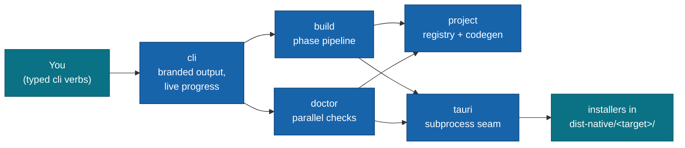

# @moku-labs/native

**Compose system plugins, get native installers — the entire permission surface is codegenned, never hand-maintained.**

`@moku-labs/native` is the Moku family's node-only native packager: a [`@moku-labs/core`](https://github.com/moku-labs/core) Layer-2 framework that wraps [Tauri 2](https://v2.tauri.app) end-to-end. It generates a gitignored Tauri project, codegens the permission surface (Tauri capabilities, the `Info.ios.plist` sidecar, `AndroidManifest.xml` needs) from whichever system plugins your app composed, and drives `tauri build` for all five targets — macOS, Windows, Linux, iOS, Android. It is not a runtime and ships nothing inside your app: the generated Tauri project is disposable build output, never committed source.

<br/>

[](https://www.npmjs.com/package/@moku-labs/native)
[](#requirements)
[](#requirements)
[](https://github.com/moku-labs/core)
[](./LICENSE)

<br/>

[Quick start](#quick-start) · [Two apps, one contract](#two-apps-one-contract) · [Plugins](#plugins) · [Configuration](#configuration) · [Events](#events) · [Docs](#docs)

---

## Why @moku-labs/native

- **The composition IS the permission surface.** Declare `{ name: "notification" }` once in `config.system` and the capability registry resolves it into npm/crate dependencies, Rust plugin init, capability JSON, and mobile permission needs — no hand-edited `tauri.conf.json`, no drifting plist.
- **Generated, gitignored, regenerable.** `.moku/tauri/` is build output, not source. Delete it, run a build, and the write-if-changed generators reproduce it byte-for-byte — the "minimal troubles" promise lives here.
- **One subprocess seam.** Only the `tauri` plugin spawns processes — everything reaching `@tauri-apps/cli` goes through its argv builders, entropy-gated secret scrubbing, error taxonomy, and process-group dev lifecycle.
- **A packager, not a runtime.** Node-only, the deploy/CLI analogue for native packaging. Nothing here executes inside your shipped app; your web app stays exactly what it was.
- **Secrets stay in env vars.** Config carries env-var *references* only (`signing.android.keystorePasswordEnv`), doctor checks presence without reading values, and every subprocess output line is scrubbed before it can reach a log.

## Quick start

```sh
bun add @moku-labs/native
```

> [!NOTE]
> **Status: `0.x` — early.** `@moku-labs/core` and `@moku-labs/common` install transitively as regular dependencies — one `bun add` is the whole install. A real `node` binary on PATH is a hard prerequisite (`@tauri-apps/cli` cannot run under bun); `native doctor` checks it.

A native app is its own `createApp` — typically `src/native.ts`, beside your web app:

```ts
// src/system.ts — the system-plugin composition, shared with your web app
export const systemPlugins = [{ name: "store" }, { name: "deep-link" }];
```

```ts
// src/native.ts — the native createApp (Layer 3)
import { createApp } from "@moku-labs/native";
import { systemPlugins } from "./system";

export const native = createApp({
  config: {
    app: { name: "MyApp", identifier: "com.example.myapp" },
    web: {
      build: "bun run build",
      devCommand: "bun run dev", devUrl: "http://localhost:5173",
      dist: "dist"
    },
    system: systemPlugins,
    capabilities: { "deep-link": { mode: "scheme", scheme: "myapp" } }
  }
});
```

```ts
// scripts/native-build.ts — one thin script per verb
import { native } from "../src/native";

await native.start();
await native.cli.build({ target: "macos" }); // installers land in dist-native/macos/
await native.stop();
```

> [!IMPORTANT]
> Add `.moku/` and `dist-native/` to your `.gitignore`. The generated Tauri project is never committed — it is fully regenerable output.

## How it works



Each `build.run({ target })` walks the phase pipeline `scaffold → codegen → icons → compile → bundle → collect` (the `PHASE_ORDER` constant), emitting a global `native:phase` event per phase and `native:complete` on success — which is exactly what `cli` renders as live progress. `project` and `tauri` never call each other; `build` orchestrates them, `doctor` reads them, `cli` fronts all four.

### The composition is the contract

`config.system` is a name-only array — `ReadonlyArray<{ name: string }>` — and that one list drives the whole packaging surface. The `project` plugin resolves each name against its capability registry (`store`, `notification`, `clipboard-manager`, `tray`, `deep-link`) into a `ResolvedCapability`: npm package + crate ranges, Rust init line, capability permissions, per-platform applicability, and conf fragments. Unknown names fail at composition time, not at build time. In v1 the mobile permission surface is conf-only by verified design — the official Tauri plugins self-merge their own manifest needs — so zero fragile XML patching ships at all.

## Two apps, one contract

Your project runs **two `createApp`s side by side**: the web/node app you already have, and the native app (`src/native.ts`) from this framework. Plugins are bound to their own framework's chain, so native plugins can never be composed into the web app — the two apps integrate at the edges instead:

- **`src/system.ts` is the shared contract.** Both apps import the same array of `{ name }` system-plugin declarations. The web app uses it to know which capabilities exist; the native app codegens the entire permission surface from it. One list, no drift — this is the cross-team contract.
- **Scripts stay thin, one verb each.** `package.json` wires per-verb consumer scripts that call the native app's typed `cli` verbs — there is no argv CLI to parse:

  ```jsonc
  {
    "scripts": {
      "native:dev": "bun run scripts/native-dev.ts",
      "native:build": "bun run scripts/native-build.ts",
      "native:doctor": "bun run scripts/native-doctor.ts",
      "native:clean": "bun run scripts/native-clean.ts"
    }
  }
  ```

  ```ts
  // scripts/native-doctor.ts
  import { native } from "../src/native";

  await native.start();
  const ok = await native.cli.doctor();
  await native.stop();
  if (!ok) process.exitCode = 1;
  ```

- **Directory roles.** `projectDir` (default **`.moku/tauri/`**) is the generated Tauri project — gitignored, fully regenerable, never committed. `outDir` (default **`dist-native/`**) is where finished installers are collected, per target (`dist-native/macos/`, `dist-native/android/`, …).

## Plugins

| Plugin | Tier | Key API | Responsibility |
|---|---|---|---|
| [`project`](./src/plugins/project/README.md) | Complex | `generate` · `completeness` · `patchMobile` · `clean` · `resolve` | Capability registry + `.moku/tauri` generators + write-if-changed writer + mobile init-once-then-patch. Owns the generated tree as *files*; never spawns. |
| [`tauri`](./src/plugins/tauri/README.md) | Standard | `icon` · `build` · `mobileInit` · `dev` · `version` | The framework's **only** subprocess seam: `@tauri-apps/cli` argv builders, injectable spawn, process-group dev lifecycle, error taxonomy, secret scrubbing. |
| [`build`](./src/plugins/build/README.md) | Standard | `run` · `runAll` | Sequential per-target phase pipeline; emits `native:phase`/`native:complete`; owns the `collect` phase (bundle-location table → `dist-native/<target>/`). |
| [`doctor`](./src/plugins/doctor/README.md) | Complex | `run` | Per-target toolchain/completeness/version-skew diagnosis via a `checks/` registry, run in parallel — one broken check never sinks the report. |
| [`cli`](./src/plugins/cli/README.md) | Standard | `build` · `dev` · `doctor` · `clean` | Typed verb surface — no argv parsing. Branded rendering (`@moku-labs/common/cli`), live progress via event hooks. |

Every lower-level surface stays reachable on the composed app: `native.project.generate(…)`, `native.tauri.version()`, `native.build.runAll()`, `native.doctor.run()` — `cli` is convenience, not a gate.

## Configuration

The substantive surface is **global** `Config` — every plugin reads it via `ctx.global`; per-plugin configs are minimal seams.

| Field | Type | Default | Notes |
|---|---|---|---|
| `app` | `{ name: string; identifier: string; version?: string }` | `{ name: "", identifier: "" }` | Required — validated at composition time: non-empty `name`, reverse-DNS `identifier`. |
| `web` | `{ build: string; devCommand: string; devUrl: string; dist: string; cwd?: string }` | `build: "bun run build"`, `devCommand: "bun run dev"`, `devUrl: "http://localhost:5173"`, `dist: "dist"` | Web build/dev wiring codegenned into `tauri.conf.json`; `cwd` for monorepo layouts. |
| `system` | `ReadonlyArray<{ name: string }>` | `[]` | The composed system plugins — the shared cross-team contract. Unknown names throw at init. |
| `capabilities` | `Partial<CapabilityConfigMap>` | `{}` | Per-capability packaging parameters. `deep-link` requires `{ mode: "scheme", scheme: string }`. |
| `targets` | `readonly Target[]` | all five (`macos`, `windows`, `linux`, `ios`, `android`) | Which targets this app ships; the `runAll`/`doctor` default scope. |
| `projectDir` | `string` | `".moku/tauri"` | Generated Tauri project root (contains `src-tauri/`). Gitignored build output. |
| `outDir` | `string` | `"dist-native"` | Installer delivery root — `collect` copies finished artifacts to `outDir/<target>/`. |
| `signing` | `SigningConfig` | `{}` | Env-var **references** and config-safe identifiers only — never raw secrets. `android: { keystorePath?, keystorePasswordEnv?, keyAlias? }`, `windows: { certificateThumbprint? }`. |

Per-plugin knobs, overridable via `createApp({ pluginConfigs })`:

| Plugin | Knob | Default | Purpose |
|---|---|---|---|
| `tauri` | `spawnImpl` / `nodePath` | `undefined` / `undefined` | Test seam / explicit `node` path (default: real process-group spawn, PATH-walked node). |
| `tauri` | `readiness` | `{ intervalMs: 250, timeoutMs: 60_000 }` | `dev()`'s devUrl readiness poll — there is no stdout "ready" marker. |
| `doctor` | `probeImpl` | `undefined` | Test seam for binary probes (default: real `which`/`--version` subprocesses). |
| `cli` | `renderImpl` / `confirmImpl` | `undefined` / `undefined` | Test seams (default: branded console + styled confirm from `@moku-labs/common/cli`). |

## Events

Two **global framework events** are declared in `src/config.ts` — emitted by `build`, hooked by `cli`, hookable by any plugin without a depends edge:

```ts
"native:phase": {
  target: Target;
  phase: NativePhase; // "scaffold" | "codegen" | "icons" | "compile" | "bundle" | "collect"
  status: "start" | "progress" | "done" | "error";
  durationMs?: number;
  detail?: string; // progress ticks ("Compiling tauri 3/50"), skip reasons, error text
};
"native:complete": {
  target: Target;
  outPath: string; // dist-native/<target>/
  artifacts: readonly string[];
  durationMs: number;
};
```

One **per-plugin event** is declared by `doctor` (hookable via a `depends: [doctorPlugin]` edge):

```ts
"doctor:check": CheckResult; // { id, target: Target | "host", status: "pass" | "warn" | "fail", message, fixIt? }
```

> [!TIP]
> Compile progress details carry real crate counts parsed from cargo output — never a synthesized percentage.

## Scripts

```sh
bun run build              # Build with tsdown
bun run lint               # Biome check + ESLint
bun run lint:fix           # Auto-fix lint issues
bun run format             # Format with Biome
bun run test               # Run all tests (vitest)
bun run test:unit          # Unit tests only
bun run test:integration   # Integration tests only
bun run test:coverage      # Tests with coverage (90% threshold)
bun run validate           # publint + are-the-types-wrong (publish readiness)
```

## Development

- **Adding a plugin** — create `src/plugins/<name>/` with `index.ts` (the `createPlugin` call), `types.ts`, and an API factory; register the instance in `src/index.ts`'s plugin array and re-export it from `src/plugins/index.ts`. Consumer apps can also author their own plugins with the exported `createPlugin` and pass them to `createApp({ plugins: [...] })`.
- **Tests** — plugin-specific tests are colocated (`src/plugins/<name>/__tests__/unit/` and `__tests__/integration/`); root `tests/` holds framework-level integration only. All subprocess/render/probe seams are injectable, so the suite runs without any native toolchain.

## Requirements

- **Node `>= 24`** and **Bun `>= 1.3.14`** — use `bun` exclusively (never npm/yarn/pnpm). A real `node` binary must also be on PATH for `@tauri-apps/cli`.
- **TypeScript** in strict mode, with `exactOptionalPropertyTypes` and `noUncheckedIndexedAccess`.
- **[`@moku-labs/core`](https://github.com/moku-labs/core)** — the micro-kernel this framework is built on (direct dependency).
- Native toolchains (Rust, Xcode, Android SDK/NDK) only for the targets you actually build — `native doctor` tells you what's missing per target.

## Docs

- Per-plugin references: [`project`](./src/plugins/project/README.md) · [`tauri`](./src/plugins/tauri/README.md) · [`build`](./src/plugins/build/README.md) · [`doctor`](./src/plugins/doctor/README.md) · [`cli`](./src/plugins/cli/README.md)
- LLM-ready docs: [`llms.txt`](./llms.txt) (concise) · [`llms-full.txt`](./llms-full.txt) (full type/event/config reference)
- [Moku Core specification](https://github.com/moku-labs/core/tree/main/specification) — the three-layer model, factory chain, lifecycle, and event system this framework implements.

## License

[MIT](./LICENSE) © [moku-labs](https://github.com/moku-labs)
